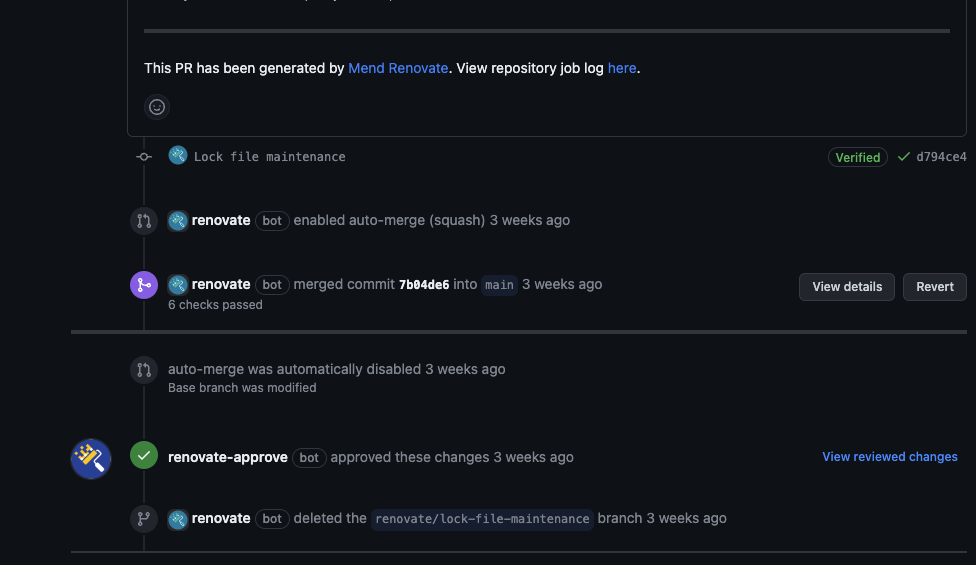

# Python CLI Template

[](https://github.com/brett-fitz/python-cli/blob/main/LICENSE)
[](https://github.com/brett-fitz/python-cli/issues)

Simple Python CLI template with...

* Click
* Mkdocs
* Poetry
* Renovate

## Overview

`pycli` - Both the cli and package are named **pycli**. Poetry requires the package
name to match the project name or it must be included in the packages section.

### :package: Poetry

Poetry is used for dependency management and packaging. [Poetry Docs](https://python-poetry.org/docs/)

#### Dependency Groups

**Dev**

Developer dependencies that are not required for the code to run in production.

**Docs**

Dependencies for building documentation with mkdocs.

**Test**

Unitesting dependencies.

### :arrow_up: Renovate

Renovate is used for automating the management of dependencies including git submodules.
The current config is setup to **open PRs every weekend**.

#### Auto-Approval/Merge of Minor Updates

The current config is setup to automerge specific updates that are deemed unlikely to cause conflicts.

```
["minor", "patch", "pin", "digest"]
```

##### Recommended Setup for Auto-Approval

In order to ensure that minor dependency updates do not cause issues and **Continuous Delivery**
can be applied without the need of a developer approval, the following setup should be implemented:

**Implement Branch Protection Rules**

* Require a pull request before merging
  * Require Approvals (1)
* Require status checks to pass before merging
* Require converstation resolution before merging

**Add Unittests**

Utilizing either pytest, unittests, or comparable unittesting framework, implement unittests that 
provide effective coverage across the package codebase.

**GitHub Actions**

Use the github action example to execute unittests using a matrix of supported python versions
for the project to ensure operability.

**Add renovate-approve bot**

In order to successfully pass the branch protection rule, "Require Approvals (1)", we must have a
user or bot approve the PRs we want to automerge. Thankfully renovate has provided a bot we can
easily add to our repos to enable this feature:

https://github.com/apps/renovate-approve



### Mkdocs

MkDocs is a static site generator for project documentation. Included with mkdocs is [Material for MkDocs](https://squidfunk.github.io/mkdocs-material/getting-started/).

#### Plugins

* search - Add search to your documentation.
* mkdocstrings - Automated documentation of your code.
* table-reader - Insert CSVs and other table formats with ease.
* minify - A mkdocs plugin to minify the HTML of a page before it is written to disk.

## Help :construction_worker:

#### Join us in discussions
I use GitHub Discussions to talk about all sorts of topics related to this repo.

#### Open an issue
First, check out the [existing issues](https://github.com/brett-fitz/python-cli/issues). If you spot
something new, open an issue. We'll use the issue to have a conversation about the problem you want
to fix, and I'll try to get to it as soon as I can.

