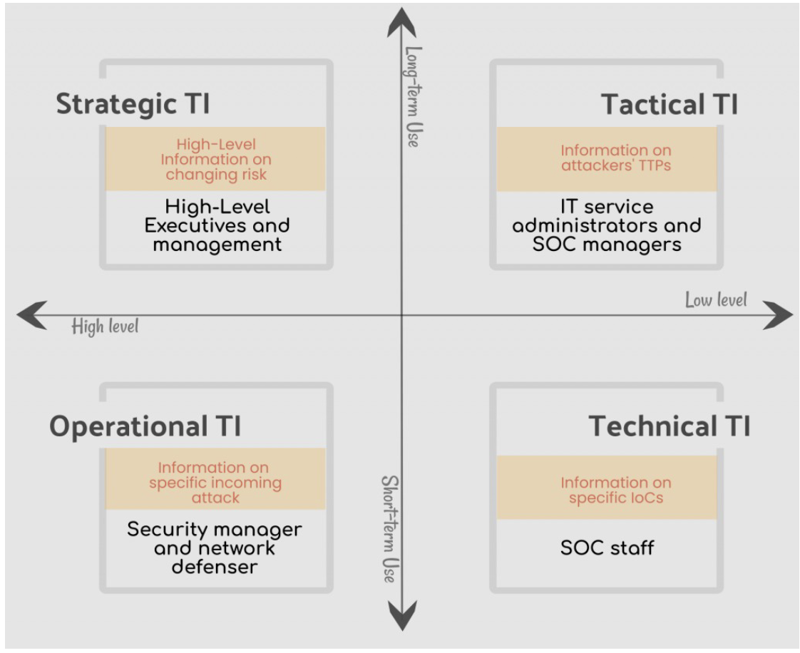

# Overview

## Threat Intelligence

Before we get into what is proactive threat intelligence, lets first define what threat intelligence is and how we got here.

> Cyber Threat Intelligence is “evidence-based knowledge about adversaries – their motives, intents, capabilities, enabling
> environments and operations – focused on an event, series of events or trends, and providing a ‘decision’ advantage to the defender.”

When generating threat intelligence, we can bucket it into two groups: Proactive Threat Intelligence (PTI) and Reactive Threat
Intelligence (RTI).

**What is PTI?**

Proactive threat intelligence is information that is material and can be used to inform decision making prior to a compromise. The goal of PTI is to detect threats before they occur and track adversaries before they initiate an intrusion.

**What is RTI?**

Reactive threat intelligence is information that is extracted post-compromise so we can learn from the TTPs observed. The goal is to learn as much as possible about a threat or adversary techniques, tactics, and procedures (TTPs) to inform stakeholders with actionable intelligence

### PTI Datasets

#### Malware Repositories

* Advantages: Acquire artifacts
* Disadvantages: Requires an uploader (latency)

#### Network Scanning

* Advantages: Reduced latency
* Disadvantages: Can be costly to analyze, parse and extract. 

#### Domain Registration Data

* Disadvantages: Costly to make sense of the data. No standardization and whois privacy. 

## PTI vs RTI

Proactive Threat Intelligence vs Reactive Threat Intelligence

## Resources

### Presentations

* [Scan't Touch This](https://github.com/aaronst/talks/blob/master/scanttouchthis.pdf)

### Blogs

* [SCANdalous! (External Detection Using Network Scan Data and Automation)](https://www.mandiant.com/resources/blog/scandalous-external-detection-using-network-scan-data-and-automation) 
* [Active C2 Discovery Using Protocol Emulation Part1 (HYDSEVEN NetWire)](https://blogs.vmware.com/security/2019/11/active-c2-discovery-using-protocol-emulation-part1-hydseven-netwire.html)
* [Threat Analysis: Active C2 Discovery Using Protocol Emulation Part2 (Winnti 4.0)](https://blogs.vmware.com/security/2020/02/threat-analysis-active-c2-discovery-using-protocol-emulation-part2-winnti-4-0.html)
* [Threat Analysis: Active C2 Discovery Using Protocol Emulation Part3 (ShadowPad)](https://blogs.vmware.com/security/2022/10/threat-analysis-active-c2-discovery-using-protocol-emulation-part3-shadowpad.html)
* [Threat Analysis: Active C2 Discovery Using Protocol Emulation Part4 (Dacls, aka MATA)](https://blogs.vmware.com/security/2022/11/threat-analysis-active-c2-discovery-using-protocol-emulation-part4-dacls-aka-mata.html)
* [Inside the IcedID BackConnect Protocol](https://www.team-cymru.com/post/inside-the-icedid-backconnect-protocol)
* [Inside the IcedID BackConnect Protocol (Part 2)](https://www.team-cymru.com/post/inside-the-icedid-backconnect-protocol-part-2)
* [Active Lycantrox infrastructure illumination](https://blog.sekoia.io/active-lycantrox-infrastructure-illumination/)
* [CustomerLoader: a new malware distributing a wide variety of payloads](https://blog.sekoia.io/customerloader-a-new-malware-distributing-a-wide-variety-of-payloads/#h-c2-infrastructure)
* [Raccoon Stealer v2 – Part 2: In-depth analysis](https://blog.sekoia.io/raccoon-stealer-v2-part-2-in-depth-analysis/)
* [Stealc: a copycat of Vidar and Raccoon infostealers gaining in popularity – Part 2](https://blog.sekoia.io/stealc-a-copycat-of-vidar-and-raccoon-infostealers-gaining-in-popularity-part-2/#h-command-and-control-communication)
* [Peeking at Reaper’s surveillance operations](https://blog.sekoia.io/peeking-at-reaper-surveillance-operations-against-north-korea-defectors/)
* [Command & Control infrastructures tracked by Sekoia.io in 2022](https://blog.sekoia.io/command-control-infrastructures-tracked-by-sekoia-io-in-2022/)
* [New RisePro Stealer distributed by the prominent PrivateLoader](https://blog.sekoia.io/new-risepro-stealer-distributed-by-the-prominent-privateloader/)
* [Darkcomet Hacking the hacker](https://www.techanarchy.net/darkcomet-hacking-the-hacker/)
* [BlueDelta Exploits Ukrainian Government Roundcube Mail Servers to Support Espionage Activities](https://go.recordedfuture.com/hubfs/reports/cta-2023-0620.pdf)
